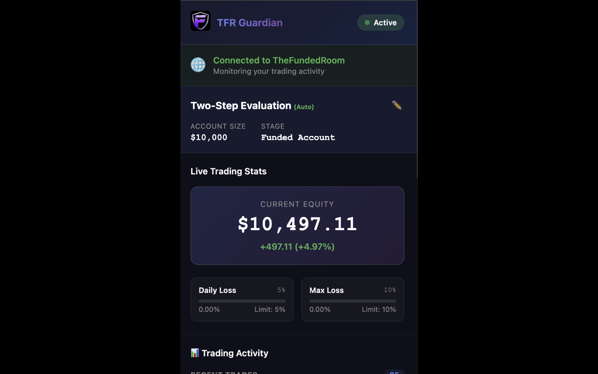
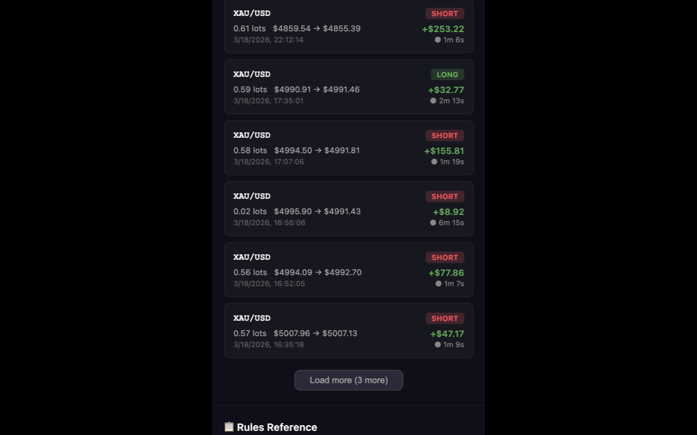
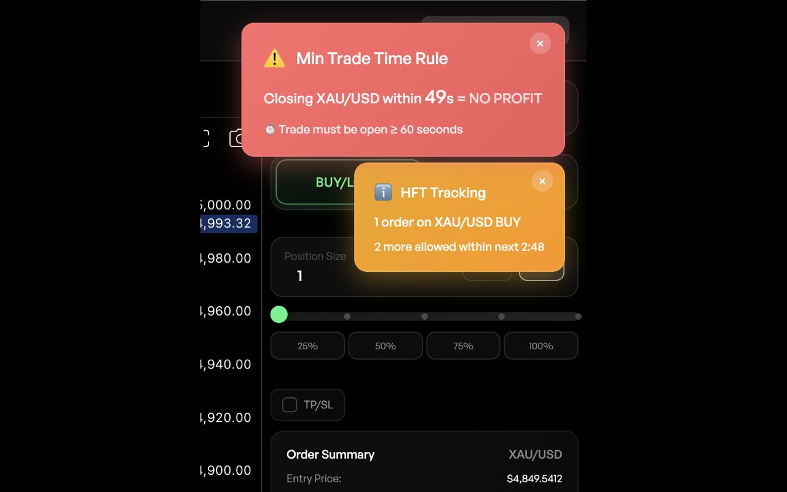
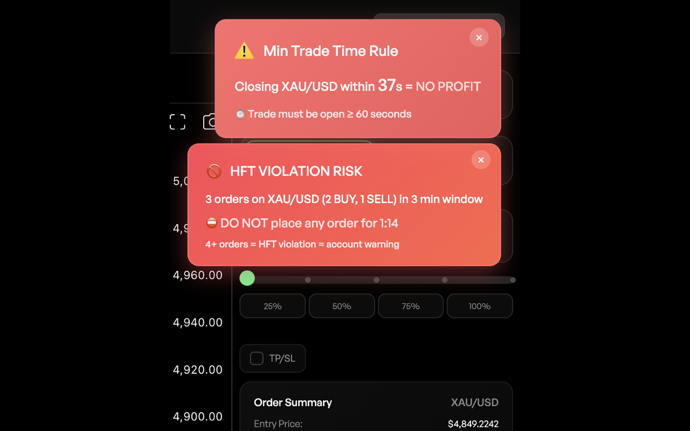

# TheFundedRoom Rules Guardian

A Chrome extension that monitors your trading activity on TheFundedRoom and warns you before breaking any prop trading rules.

## Features

### 1. Auto Account Detection
- Automatically detects your account type, size, and stage from TheFundedRoom
- No manual configuration needed

### 2. Live Trading Stats
- **Current Equity**: Real-time balance with percentage change
- **Daily Loss**: Tracks from daily peak (not starting balance)
- **Max Loss**: Total drawdown from initial capital

### 3. Trading Activity
- Recent closed trades with P&L, lot size, entry/exit prices
- Trade duration for each position
- "Load more" pagination (3 trades at a time)

### 4. Toxicity Level Monitoring
- Tracks sub-1-minute trades
- Shows profit at risk (not paid out) vs losses counted
- Calculates both trade % and profit % toxicity
- Suggestions to reduce toxicity below 10%

### 5. Daily Target (Funded Accounts)
- Set custom daily profit targets
- Track progress toward payout eligibility

### 6. In-Page Warnings
- **Min Trade Time Rule**: 60-second countdown when position opens
- **HFT Tracking**: Warns when approaching 3 orders in 3 minutes per symbol
- **Max Risk Per Trade**: Alerts when risk exceeds 3% (funded stage)

## Screenshots

### Dashboard Overview

*Live trading stats showing current equity, daily loss, max loss, and account information*

### Trading Activity

*Recent trades with P&L, lot sizes, entry/exit prices, and trade duration*

### Min Trade Time Warning

*In-page notification warning that closing within 60 seconds = no profit*

### HFT Violation Risk

*High-frequency trading alert showing 3 orders in 3-minute window with cooldown timer*

---

## How to Use

### Installation
1. Open Chrome and go to `chrome://extensions/`
2. Enable "Developer mode" (toggle in top right)
3. Click "Load unpacked"
4. Select the folder containing this extension
5. The extension icon will appear in your toolbar

### Using the Extension

1. **Navigate to TheFundedRoom**: Go to `thefundedroom.com` and log in
2. **Open the Popup**: Click the TFR Guardian icon in your Chrome toolbar
3. **View Dashboard**: See your live equity, daily loss, max loss, and trading activity

### Dashboard Sections

| Section | Description |
|---------|-------------|
| **Account Info** | Auto-detected account type, size, and stage |
| **Live Trading Stats** | Current equity, daily loss %, max loss % |
| **Daily Target** | Your profit goal progress (funded accounts) |
| **Toxicity Level** | Sub-1-minute trade monitoring with suggestions |
| **Trading Activity** | Recent trades with P&L and duration |
| **Rules Reference** | Detailed rules for your account type |

### In-Page Notifications

When trading on TheFundedRoom, you'll see:

- **Red Warning (Min Trade Time)**: Appears when you open a trade, counts down 60 seconds. Closing early = no profit.
- **Orange Warning (HFT Tracking)**: Shows at 1-2 orders per symbol in 3 minutes.
- **Red Warning (HFT Violation)**: Shows at 3+ orders. Stop trading for the cooldown period.

### Refresh Connection

If the extension shows "Not on TheFundedRoom" incorrectly:
1. Click the **🔄 Refresh** button in the status bar
2. The extension will re-check your connection and reload data

### Recheck Toxicity

To manually refresh toxicity calculations with animation:
1. Click the **🔄 Recheck Toxicity** button
2. Wait 2 seconds for the animation to complete

## Permissions

The extension requires these permissions:

- **activeTab**: Detect when you're on TheFundedRoom
- **tabs**: Platform detection and refresh functionality
- **storage**: Save settings and daily statistics
- **notifications**: Desktop alerts for rule violations
- **Host permissions**: Access to thefundedroom.com and API endpoints

## Troubleshooting

### "Not on TheFundedRoom" when I am
- Click the **🔄 Refresh** button
- Or reload the TheFundedRoom page

### Data not updating
- The extension polls data every few seconds automatically
- Click **🔄 Recheck Toxicity** for manual refresh

### Notifications not showing
- Check Chrome notification permissions
- Ensure "Show Notifications" toggle is ON in extension settings

## Technical Details

- **Manifest Version**: 3
- **Permissions**: 4 (activeTab, tabs, storage, notifications)
- **Daily Reset**: 2:00 AM UTC
- **Data Source**: TheFundedRoom API + DOM scraping

## Support

For issues or feature requests, contact the developer.

---

**Version**: 1.0.0  
**Developer**: Akash Kumar
